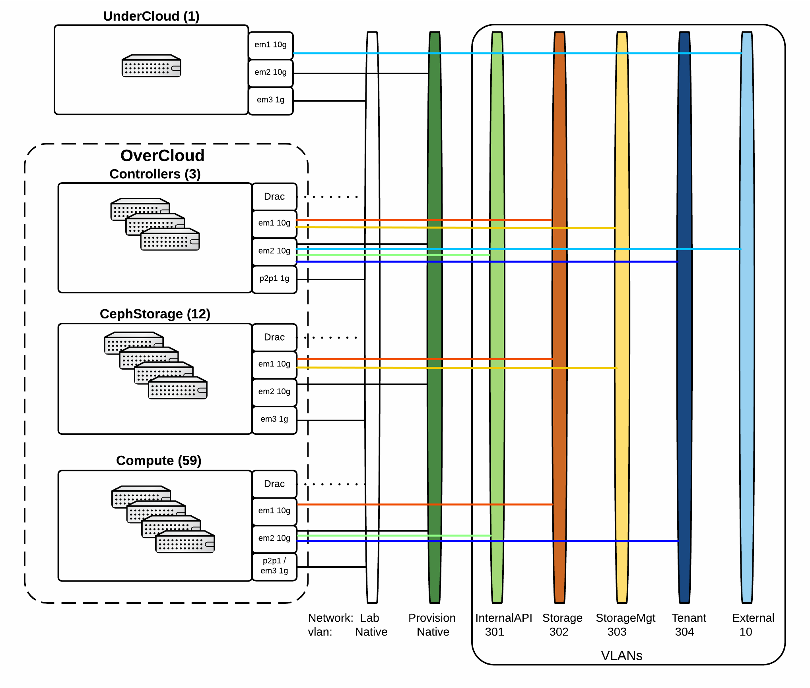

# 74 Node Cloud with 12 Ceph Nodes for Telemetry testing

## Node Types
* 3 x R630 for Controllers
* 59 x R630/R620 for Computes (Mixed nodes)
* 12 x 730xd for CephStorage (16 OSDs ea. Journal on NVMe)

## Network Diagram


## Scheduler-hints / Pinning nodes

I used scheduler-hints to ensure a deterministic node placement in this deployment.  You must tag each ironic node as such (Use your own ironic uuids):

```
## Controllers
# openstack baremetal node set --property capabilities='node:controller-0,cpu_vt:true,cpu_hugepages:true,cpu_txt:true,cpu_aes:true,cpu_hugepages_1g:true' 71976f04-8db7-4967-9bf6-84f945ee8d50
# openstack baremetal node set --property capabilities='node:controller-1,cpu_vt:true,cpu_hugepages:true,cpu_txt:true,cpu_aes:true,cpu_hugepages_1g:true' 7cb4493d-e45d-4e5d-bef1-5b7fae525971
# openstack baremetal node set --property capabilities='node:controller-2,cpu_vt:true,cpu_hugepages:true,cpu_txt:true,cpu_aes:true,cpu_hugepages_1g:true' 4cc231aa-e8c0-4fc9-9fcc-7edd8e64eb8e
## Ceph Storage nodes
# openstack baremetal node set --property capabilities='node:cephstorage-0,cpu_vt:true,cpu_hugepages:true,cpu_txt:true,cpu_aes:true,cpu_hugepages_1g:true' c89ba4c8-7b0f-474d-9ff1-e723aee7afdc
...
# openstack baremetal node set --property capabilities='node:cephstorage-11,cpu_vt:true,cpu_hugepages:true,cpu_txt:true,cpu_aes:true,cpu_hugepages_1g:true' 4aeda9d8-9dcb-45a6-8402-b9aa33c5ea92
## Computes
# openstack baremetal node set --property capabilities='node:novacompute-0,cpu_vt:true,cpu_hugepages:true,cpu_txt:true,cpu_aes:true,cpu_hugepages_1g:true' 6c604f00-39d7-465f-bae7-8ad00a3d9888
...
# openstack baremetal node set --property capabilities='node:novacompute-55,cpu_vt:true,cpu_hugepages:true,cpu_txt:true,cpu_aes:true,cpu_hugepages_1g:true' 6554888c-164f-4c5b-ba9b-b45d620e8cfc
```

Additionally, root devices via Serial/WWN should be set to ensure the correct disk is used for / on the CephStorage node (or any multi-disk node for that matter)

```
# openstack baremetal node set --property root_device='{"serial": "614187705f84ae001e4fa8470d8a5115"}' c89ba4c8-7b0f-474d-9ff1-e723aee7afdc
... (Rest of your CephStorage Nodes)
```

## Example deployment command

Use provided template yamls in this repo with the following deploy command:

```
# date;time openstack overcloud deploy --templates -e /home/stack/templates/scheduler-hints.yaml -e /usr/share/openstack-tripleo-heat-templates/environments/network-isolation.yaml -e /ho
me/stack/templates/network-environment.yaml -e /usr/share/openstack-tripleo-heat-templates/environments/puppet-pacemaker.yaml -e /home/stack/templates/storage-environment.yaml -e /home/stack/templates/ceph-pool-tune.yam
l --libvirt-type=kvm --ntp-server clock.redhat.com --neutron-network-type vxlan --neutron-tunnel-types vxlan --control-scale 3 --compute-scale 59 --ceph-storage-scale 12 --control-flavor bare
metal --compute-flavor baremetal --ceph-storage-flavor baremetal ;date
```
